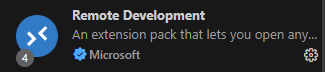
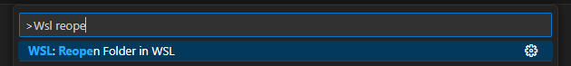
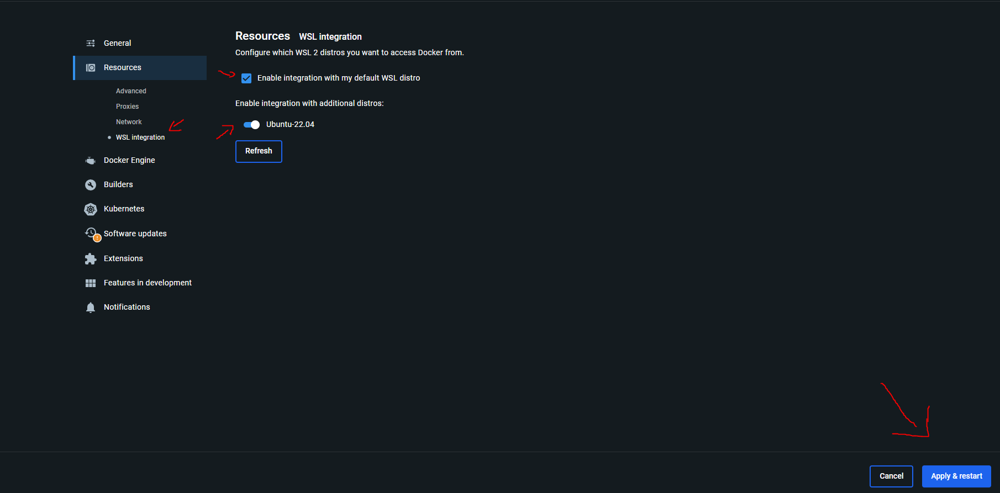

# Engenharia de Dados

Trabalho final da disciplina de engenharia de dados da SATC

# Instruções para Rodar o Docker Compose

Serão criados containers para o Apache Airflow (webserver, scheduler, worker e database), Redis, Postgres e para o CloudBeaver

### Requisitos
* Ambiente Linux
* Docker & Docker Compose

## Utilizando WSL2 no Windows
### 1. Iniciar Repositório dentro do WSL2:
O repositório deve ser iniciado dentro do WSL2 e no VSCode é necessário instalar a extensão `Remote Development`





### 2. Abrir o repositório com VSCode
Abra o repositório através do WSL2 e verifique se o VSCode está conectado (canto inferior esquerdo) conforme mostrado na imagem abaixo:


### 3. Verificar Conexão com WSL2:
Se o repositório não estiver aberto no WSL2, pressione `Ctrl+Shift+P` e procure por "WSL: Reopen Folder", conforme mostrado na imagem a seguir:




### 4. Habilitar o docker dentro da WSL

Para habilitar o docker dentro da WSL é necessário abrir o docker hub no windows ir em `Settings` e depois `Resources` > `WSL integration` e ativar a integração com a distro desejada



## Setup do Airflow ([Documentação Oficial](https://airflow.apache.org/docs/apache-airflow/stable/howto/docker-compose/index.html))

1. Primeiro é necessário criar as pastas conforme a documentação oficial
```bash
cd src
mkdir -p ./dags ./logs ./plugins ./config
echo -e "AIRFLOW_UID=$(id -u)" > .env
cd ..
```

2. Iniciar o banco de dados e rodar migrations
```bash
docker compose up airflow-init
```

3. Iniciar o Airflow
```bash
docker compose up  -d
```

4. Se tudo funcinou corretamente:
- O Airflow webserver deve estar disponivel na porta `8082` com as credenciais de acesso:
    * username: airflow
    * password: airflow

- Uma instância do dbeaver deve estar rodando na porta `8081` onde você deve finalizar as configuraçoes iniciais do dbeaver server

5. MinIO
- O MinIO será iniciado automaticamente como parte do Docker Compose. Ele estará disponível na porta 9000.
- Para acessar a interface de administração do MinIO, abra um navegador da web e vá para http://localhost:9000.
    * username: minioadmin
    * password: minioadmin

## Integrantes

- [Alex Farias de Abreu Nabo](https://github.com/Alex-Farias)
- [Arthur de Luca Honorato](https://github.com/Arthurdelucahonorato)
- [Guilherme Machado Darabas](https://github.com/gmDarabas)
- [Paulo Roberto Simão](https://github.com/paulorsimao)
- [Rubens Scotti Junior](https://github.com/rubensscotti)
- [Stephan Anthony Marques](https://github.com/StephanAnthony)
- [Matheus Araldi](https://github.com/Araldi42)
