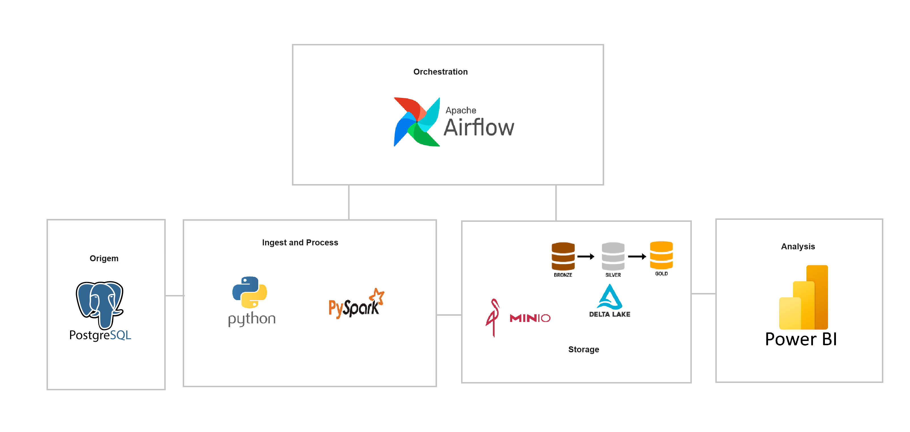
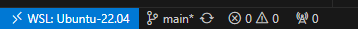

# Engenharia de Dados

[](LICENSE)

Trabalho final da disciplina de engenharia de dados da SATC

# Instruções para Rodar o Docker Compose

Serão criados containers para o Apache Airflow (webserver, scheduler, worker e database), Redis, Postgres e para o CloudBeaver

## Desenho de Arquitetura




### Requisitos
* Ambiente Linux
* Docker & Docker Compose

# Instalação
## Utilizando WSL2 no Windows
### 1. Iniciar Repositório dentro do WSL2:
O repositório deve ser iniciado dentro do WSL2 e no VSCode é necessário instalar a extensão `Remote Development`


### 2. Abrir o repositório com VSCode
Abra o repositório através do WSL2 e verifique se o VSCode está conectado (canto inferior esquerdo) conforme mostrado na imagem abaixo:




### 3. Verificar Conexão com WSL2:
Se o repositório não estiver aberto no WSL2, pressione `Ctrl+Shift+P` e procure por "WSL: Reopen Folder", conforme mostrado na imagem a seguir:


### 4. Habilitar o docker dentro da WSL

Para habilitar o docker dentro da WSL é necessário abrir o docker hub no windows ir em `Settings` e depois `Resources` > `WSL integration` e ativar a integração com a distro desejada


## Setup do Airflow ([Documentação Oficial](https://airflow.apache.org/docs/apache-airflow/stable/howto/docker-compose/index.html))

1. Primeiro é necessário criar as pastas conforme a documentação oficial
```bash
cd src
mkdir -p ./dags ./logs ./plugins ./config
echo -e "AIRFLOW_UID=$(id -u)" > .env
cd ..
```

2. Iniciar o banco de dados e rodar migrations
```bash
docker compose up airflow-init
```

3. Iniciar o Airflow
```bash
docker compose up  -d
```

4. Se tudo funcinou corretamente:
- O Airflow webserver deve estar disponivel na porta `8082` com as credenciais de acesso:
    * username: airflow
    * password: airflow

- Uma instância do dbeaver deve estar rodando na porta `8081` onde você deve finalizar as configuraçoes iniciais do dbeaver server

5. MinIO
- O MinIO será iniciado automaticamente como parte do Docker Compose. Ele estará disponível na porta 9000.
- Para acessar a interface de administração do MinIO, abra um navegador da web e vá para http://localhost:9000.
    * username: minioadmin
    * password: minioadmin

## Ferramentas utilizadas

Mencione as ferramentas que você usou para criar seu projeto

* Ferramenta 1 + link - Breve descrição
* Ferramenta 2 + link - Breve descrição
* Ferramenta 3 + link - Breve descrição

## Colaboração

Por favor, leia o [COLABORACAO](https://gist.github.com/usuario/colaboracao.md) para obter detalhes sobre o nosso código de conduta e o processo para nos enviar pedidos de solicitação.

Se desejar publicar suas modificações em um repositório remoto no GitHub, siga estes passos:

1. Crie um novo repositório vazio no GitHub.
2. No terminal, navegue até o diretório raiz do projeto.
3. Execute os seguintes comandos:

```bash
git remote set-url origin https://github.com/seu-usuario/nome-do-novo-repositorio.git
git add .
git commit -m "Adicionar minhas modificações"
git push -u origin master
```

Isso configurará o repositório remoto e enviará suas modificações para lá.

## Versão

Fale sobre a versão e o controle de versões para o projeto. Para as versões disponíveis, observe as [tags neste repositório](https://github.com/suas/tags/do/projeto). 

## Autores

Alex Farias de Abreu Nabo- (https://github.com/Alex-Farias)  
Arthur de Luca Honorato -(https://github.com/Arthurdelucahonorato)  
Guilherme Machado Darabas- (https://github.com/gmDarabas)  
Paulo Roberto Simão- (https://github.com/paulorsimao)  
Rubens Scotti Junior- (https://github.com/rubensscotti)  
Stephan Anthony Marques- (https://github.com/StephanAnthony)  
Matheus Araldi - (https://github.com/Araldi42)  

## Licença

Este projeto está sob a licença (sua licença) - veja o arquivo [LICENSE](https://github.com/jlsilva01/projeto-ed-satc/blob/main/LICENSE) para detalhes.

## Referências

Wallace Camargo - https://www.youtube.com/watch?v=nnNxe6gzb-8  
[rylativity](https://github.com/rylativity) repositorio:pyspark-deltalake-minio - https://github.com/rylativity/pyspark-deltalake-minio 
